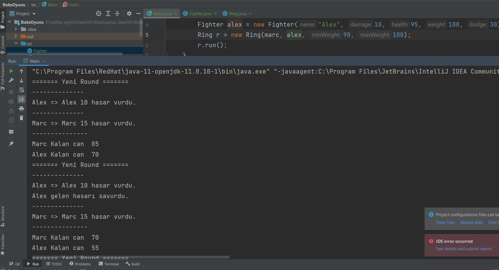

# Boks Oyunu

- Kullanıcı dövüşçü classından iki farklı nesne üretmesi gerekiyor.
- Nesne üretirken constructor içinde dövüşçünün özellikleri girilmesi gerekiyor.
- Ring class'ından bir nesne üretiliyor ve constructor değerleri giriliyor.
- Ring nesnesinden run fonksiyonu çağırılır.
- Dövüşçüler için %50 oranla ilk başlayan kişi değişiyor.

</img>