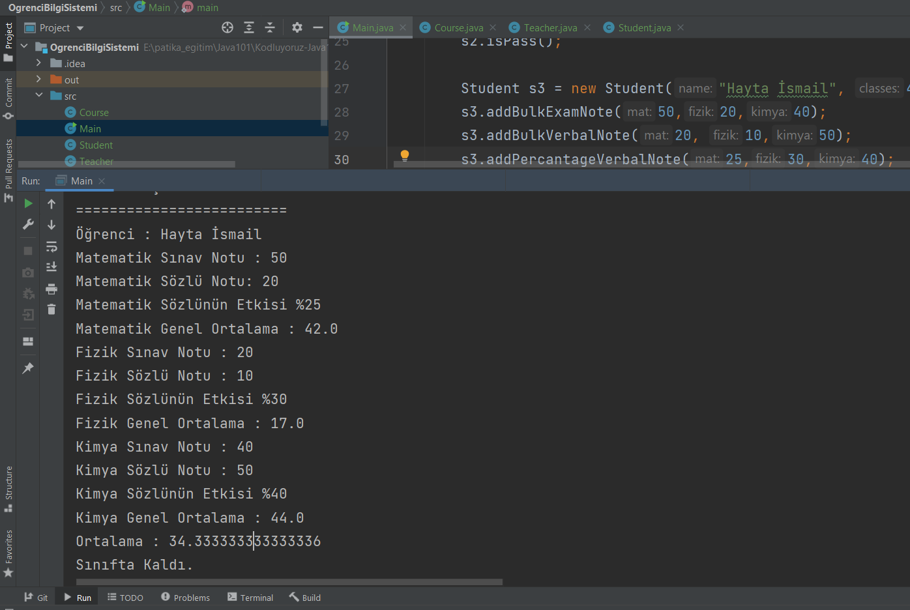

# Öğrenci Bilgi Sistemi

- Bu proje Course, Student, Teacher classlarından oluşuyor.
- Öğrencilerin sınav notu, sözlü notu ve ortalamalarının hesaplaması yapılabiliyor.
- Öğretmenlerin hangi dersi anlatacağının ataması yapılıyor.

</img>
